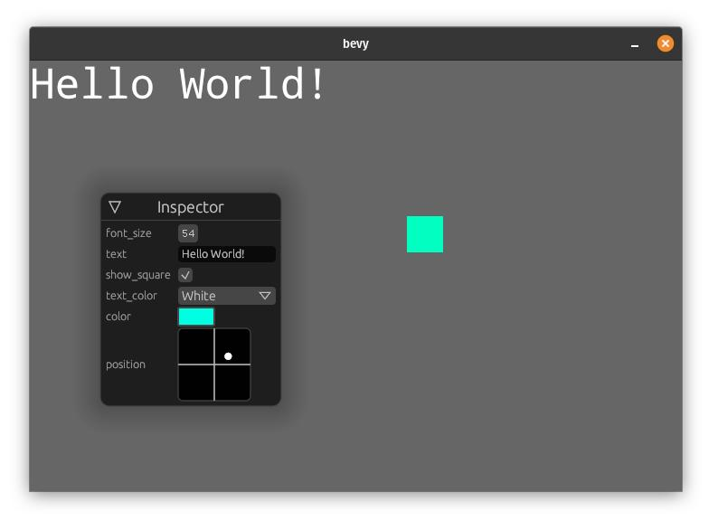
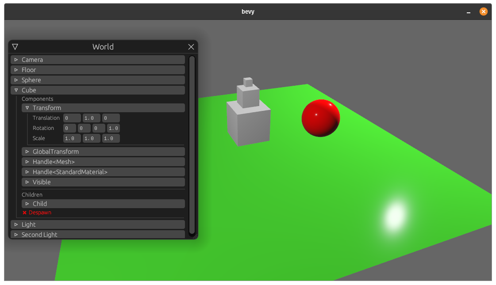

# bevy-inspector-egui

<div align="center">
  <!-- Crates version -->
  <a href="https://crates.io/crates/bevy-inspector-egui">
    
  </a>
  <!-- docs.rs docs -->
  <a href="https://docs.rs/bevy-inspector-egui">
    
  </a>
  <!-- License -->
    
</div>
<br/>

This crate provides the ability to annotate structs with a `#[derive(Inspectable)]`,
which opens a debug interface using [egui](https://github.com/emilk/egui) where you can visually edit the values of your struct live.

Your struct will then be available to you as a bevy resource.




More examples (with pictures) can be found in the [`examples folder`](examples).

## Example
```rust
use bevy_inspector_egui::Inspectable;

#[derive(Inspectable, Default)]
struct Data {
    should_render: bool,
    text: String,
    #[inspectable(min = 42.0, max = 100.0)]
    size: f32,
}
```
Add the `InspectorPlugin` to your App.
```rust
use bevy_inspector_egui::InspectorPlugin;

fn main() {
    App::build()
        .add_plugins(DefaultPlugins)
        .add_plugin(InspectorPlugin::<Data>::new())
        .add_system(your_system.system())
        .run();
}

// fn your_system(data: Res<Data>) { /* */ }
```

## World Inspector

If you want to display all world entities you can add the `WorldInspector`:
```rust
use bevy_inspector_egui::WorldInspectorPlugin;

fn main() {
    App::build()
        .add_plugins(DefaultPlugins)
        .add_plugin(WorldInspectorPlugin::new())
        .add_startup_system(setup.system())
        .run();
}
```
You can configure it by inserting the `WorldInspectorParams` resource.
If you want to only display some components, you may want to use the [InspectorQuery](./examples/README.md#inspector-query-source) instead.



## Bevy support table

|bevy|bevy-inspector-egui|
|---|---|
|0.5|0.4|
|0.4|0.1-0.3|
