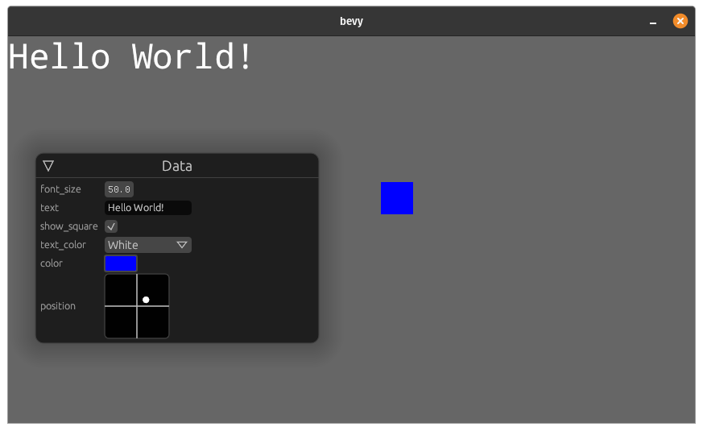
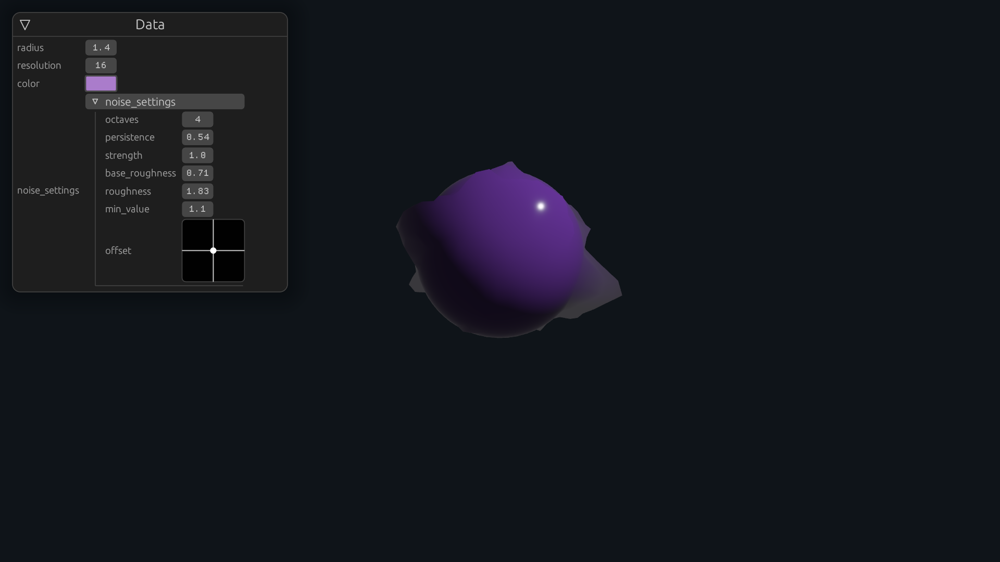
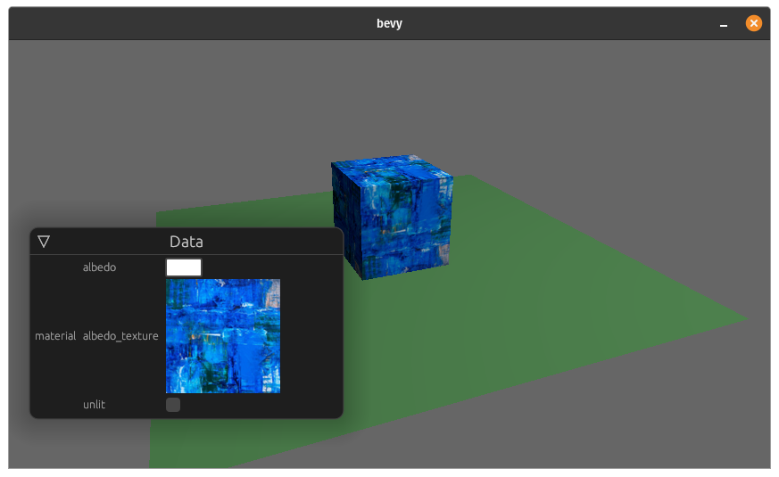
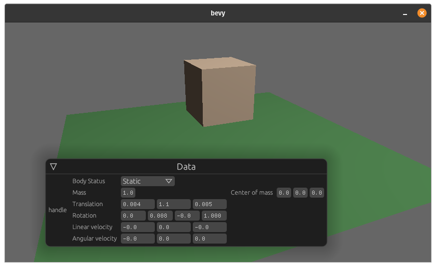
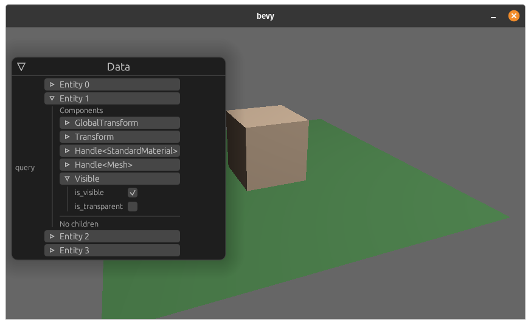
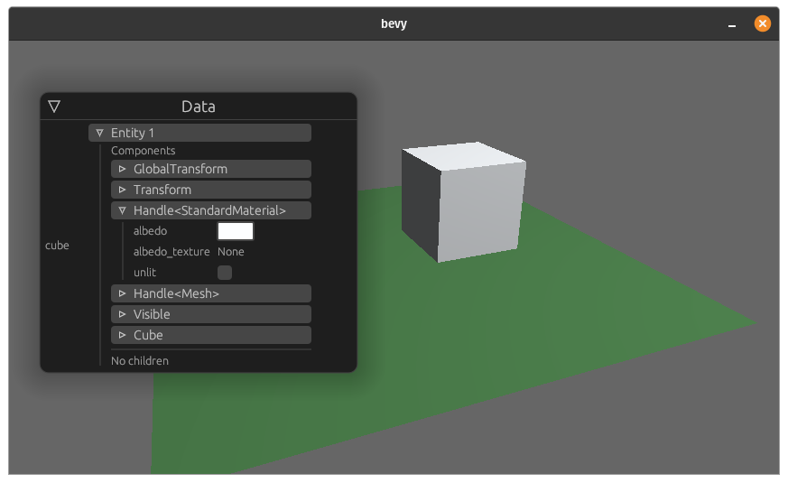
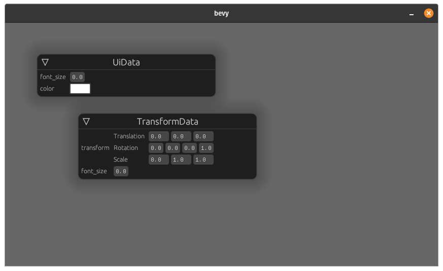
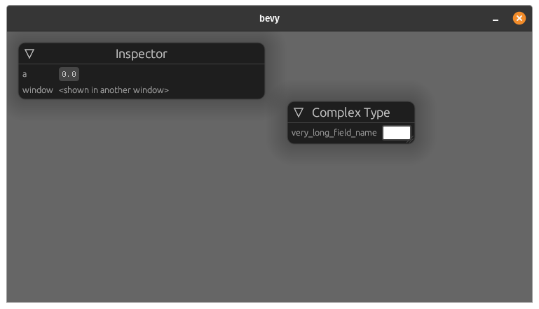
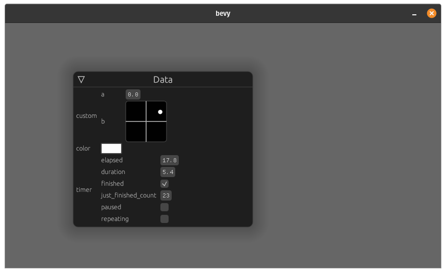
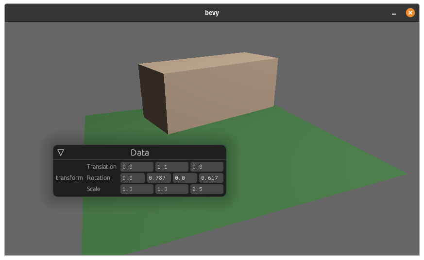

# Examples


### Simple Demo ([source](demo.rs))


### Planet Generation ([source](planet_demo.rs))


### World Inspector ([source](world.rs))


<details>
  <summary>Example code</summary>

```rust
use bevy_inspector_egui::WorldInspectorPlugin;

fn main() {
    App::build()
        .add_plugin(WorldInspectorPlugin::new())
        // ...
}
```
</details>

### Texture ([source](with_context.rs))


### Rapier Integration ([source](rapier.rs))


- requires `rapier` feature

### Inspector Query ([source](inspector_query.rs))


<details>
  <summary>Example code</summary>

```rust
use bevy_inspector_egui::widgets::InspectorQuery;

#[derive(Inspectable)]
struct Inspector {
    root_elements: InspectorQuery<Without<Parent>>
}

```
</details>

### Entity ([source](entity.rs))


### Multiple Inspectors ([source](multiple_inspectors.rs))


### New egui window ([source](new_egui_window.rs))


### Reflected UI ([source](reflected_ui.rs))


<details>
  <summary>Example code</summary>

Sometimes you want to include types not implementing `Inspectable` in your inspector. If said type implements `Reflect`, you can use the `ReflectedUI` wrapper type:

```rust
use bevy::prelude::*;
use bevy_inspector_egui::widgets::ReflectedUI;

#[derive(Inspectable)]
struct Inspector {
    timer: ReflectedUI<Timer>,
}
```
</details>

### Transform ([source](transform.rs))

